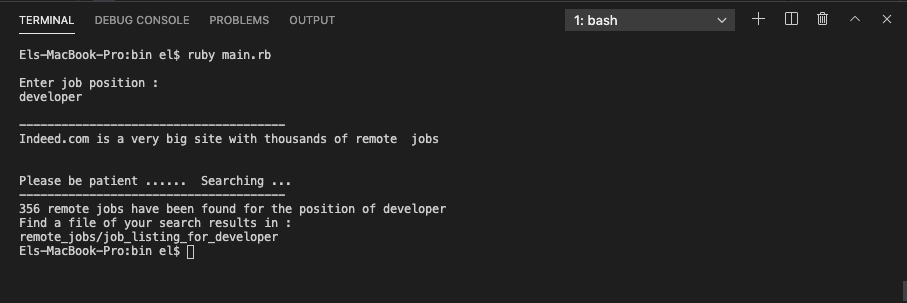

# Scraper Project 
Scraper project of indeed.com remote jobs build in Ruby

## Concept
Web Scraping (also termed Screen Scraping, Web Data Extraction, Web Harvesting etc.) is a technique employed to extract large amounts of data from websites whereby the data is extracted and saved to a local file in your computer or to a database in table (spreadsheet) format.

## Getting Started
> To get a local copy running, follow the steps below:
- Visit the main page of the repository
- Click on the `Code` button
- Clone it using `git clone`

### Prerequisites
- Ruby Version 2.7.0

### Setup
- Open to the terminal on your local PC
- Type ``` git clone ```
- Paste the link from the repository you copied when you clicked on ```Code```
- Type ```bundle install` to install the gems
- Type `cd bin` to change directory to bin
- Type `ruby main.rb` to run the program

### Running the program
- You will be prompted to Enter the job position you want to search vacancies on


- When you enter the position, the progran will ask you to be patient


- At the end of the search, a message will display on the terminal telling you:
> - The number of remote jobs for the position you searched for.
> - A path where you can find the HTML results of your search



### Screenshot of the code


### Screenshot of the search


### Built With
- Ruby 2.6.5p114 (2019-10-01 revision 67812) [x86_64-darwin18]
- Bundler
- Linters for ruby rubocop

## Running tests with Rspec

This scraper was tested with Rspec wich is a computer domain-specific language (DSL) testing tool written in programming language Ruby to test Ruby code. It is a behavior-driven development (BDD) framework which is extensively used in production applications.

## How to get Rspec running

- In the terminal, type `gem install rspec`
- Once done, go to project directory and type `rspec --init`
- You will see a folder `spec` and a file `.rspec`
- Inside spec folder you'll see a `spec_helper.rb` file.
- In the terminal, type `rspec`

## Rspec output


### Authors
👤 **Tazoh Yanick**

- GitHub: [Tazoh Yanick](https://github.com/t-yanick)
- Linkedin: [Tazoh Yanick](https://linkedin.com/in/tazoh-yanick-5a978764)

### Contributing
Contributions, issues and collaborating requests are welcome.

Feel free to check the [issues page](https://github.com/t-yanick/reddit-scraper/issues)

### Show your support
Give a star if you like this project

### Acknowledgement
- The Thanatos Microverse team
- Microverse
- Every other person or resource that helped in the realization of this project

### License
This project is [MIT]( ) licensed.